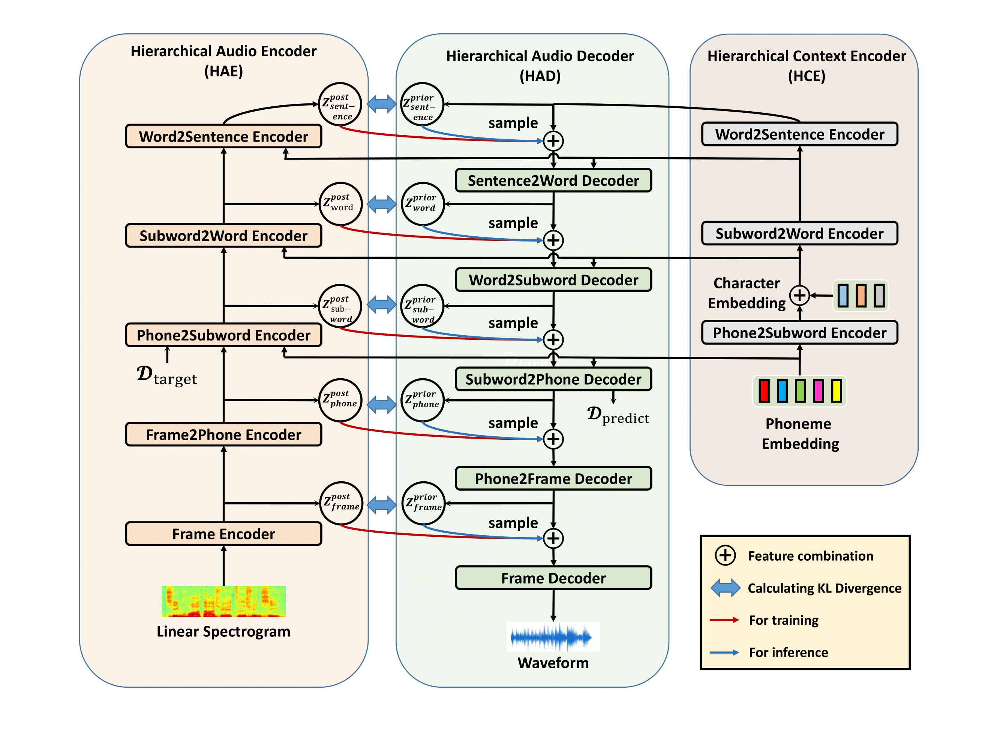

# HierTTS
HierTTS: Expressive End-to-End Text-to-Waveform using Multi-Scale Hierarchical Variational Auto-encoder

### Zengqiang Shang, Pengyang Shi, Pengyuan Zhang

In our recent [paper](https://www.mdpi.com/2076-3417/13/2/868), we propose HierTTS: Expressive End-to-End Text-to-Waveform using Multi-Scale Hierarchical Variational Auto-encoder

<table style="width:100%">
  <tr>
    <th>HierTTS</th>
  </tr>
  <tr>
    <td></td>
  </tr>
</table>

## Training Exmaple
bash run.sh

## Inference Example
bash infer.sh